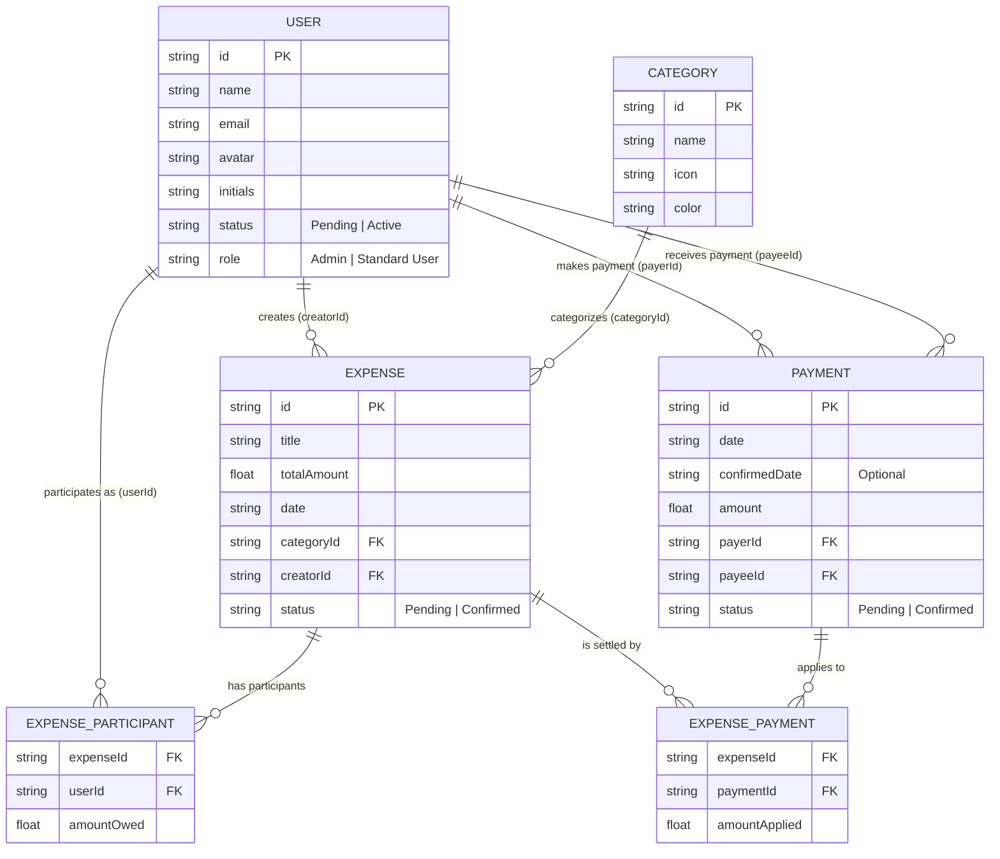

# SplitTrack: Entity-Relationship Diagram (ERD)

This document visualizes the data architecture and relational mappings for the SplitTrack application. 

The diagram below uses Mermaid.js to illustrate the core entities, their attributes, and how they interact with one another in a strictly normalized structure.

## Entity Explanations & Relations

### 1. `USER`
Represents an individual using the platform.
*   **Attributes:** Contains authentication/profile data (`name`, `email`), UI indicators (`avatar`, `initials`), and system governance fields (`status`, `role`).
*   **Relations:**
    *   **1-to-Many with EXPENSE (Creator):** A user can create multiple expenses.
    *   **1-to-Many with EXPENSE_PARTICIPANT:** A user can be linked to multiple expenses as a participant.
    *   **1-to-Many with PAYMENT (Payer/Payee):** A user can send multiple payments and receive multiple payments.

### 2. `CATEGORY`
Represents a generic grouping for expenses (e.g., Food, Travel, Groceries).
*   **Attributes:** Contains UI definitions like `icon` and `color` classes.
*   **Relations:**
    *   **1-to-Many with EXPENSE:** A category can be assigned to multiple expenses, but an expense only has one main category.

### 3. `EXPENSE`
Represents a shared cost event.
*   **Attributes:** Tracks the `totalAmount`, `date`, and `status` (for admin approvals).
*   **Relations:**
    *   Belongs to one `CATEGORY`.
    *   Created by one `USER`.
    *   **1-to-Many with EXPENSE_PARTICIPANT:** An expense links to multiple participants, detailing exactly who owes what.
    *   **1-to-Many with EXPENSE_PAYMENT:** An expense can be settled by multiple partial payments over time.

### 4. `EXPENSE_PARTICIPANT` (Bridge Table)
Resolves the many-to-many relationship between `USER` and `EXPENSE`.
*   **Attributes:** Defines the exact `amountOwed` for a specific user in a specific expense.
*   **Relations:** Links one `USER` to one `EXPENSE`.

### 5. `PAYMENT`
Represents a transaction settling a debt between two specific users.
*   **Attributes:** Tracks the exact `amount`, when it was submitted (`date`), when an admin verified it (`confirmedDate`), and its approval `status`.
*   **Relations:**
    *   Links exactly one `USER` as the sender (`payerId`).
    *   Links exactly one `USER` as the receiver (`payeeId`).
    *   **1-to-Many with EXPENSE_PAYMENT:** A single bulk payment can be split to settle multiple different expenses at once.

### 6. `EXPENSE_PAYMENT` (Bridge Table)
Resolves the many-to-many relationship between `EXPENSE` and `PAYMENT`.
*   **Attributes:** Defines the `amountApplied` from a specific payment to a specific expense.
*   **Relations:** Links one `PAYMENT` to one `EXPENSE`.
